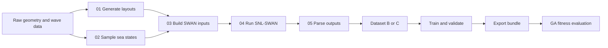

# swan-surrogate-model

Surrogate modelling for Wave Energy Converter (WEC) array-layout optimisation
with SNL-SWAN. The objective is to replace expensive wave-model simulations in
the inner loop of a Genetic Algorithm (GA) with near-real-time predictions.

## Modes

| Mode | Target | Intended use |
|---|---|---|
| B | Total absorbed power and HRA vector | Fast GA optimisation |
| C | Full significant-wave-height (Hs) field and total power | Spatial analysis and flexible HRA post-processing |

## Workflow



| Step | Current script | Main output | Status |
|---|---|---|---|
| 1 | `01_layout_generator.py` | `layouts_wecs_*.parquet` | Implemented |
| 2 | `02_sea_states_sampling.py` | `sea_states.parquet` | Implemented |
| 3 | `03_build_swan_inputs.py` | `runs/<run_id>/INPUT`, `run_index.parquet` | Implemented |
| 4 | `04_run_swan_batch.py` | SWAN outputs, `run_status.parquet` | Implemented |
| 5 | `05_parse_outputs.py` | `outputs.parquet` | Implemented prototype |
| 6--9 | Dataset, training, validation, export and GA | versioned inference bundle | Architecture and CLI stubs |

The numbered files are the source of truth for the implemented path. Older
scripts from `07_train_model.py` to `10_ga_integration.py` are an experimental
field-model route, not the final package-style workflow.

## Repository structure

```text
config/             Problem, paths and SWAN configuration
data/raw/           Deployment geometry, scatter diagram, grid and bathymetry
data/processed/     Layouts, sea states, case index, statuses and parsed targets
runs/               One isolated SNL-SWAN directory per generated case
reports/            Logs and quality/validation figures
models/             Intended model splits and exported bundles
scripts/            Command-line pipeline stages
src/swan_surrogate/ Reusable configuration, geometry and GA package code
tests/               Unit and integration tests
docs/               Tutorial and blueprint specifications
```

## Quick start

```powershell
# Create environment
conda env create -f environment.yml
conda activate swan-surrogate

# Create project-specific config files and edit them
Copy-Item config/problem.yaml.template config/problem.yaml
Copy-Item config/paths.yaml.template config/paths.yaml

# Generate and inspect layouts
python scripts/01_layout_generator.py
python scripts/02_check_layouts.py

# Sample sea states and construct a small SWAN test batch
python scripts/02_sea_states_sampling.py
python scripts/03_build_swan_inputs.py --max_runs 10
python scripts/04_run_swan_batch.py --dry_run

# Execute and parse SWAN
python scripts/04_run_swan_batch.py --workers 4
python scripts/05_parse_outputs.py --baseline path/to/baseline/Hs.mat
```

## Physical validity rules

- Validate geometric constraints before inference; do not apply a penalty after
  an invalid layout has been inferred.
- Apply a canonical WEC ordering before constructing model features.
- Use frozen training bounds to normalise fitness.
- Compute HRA against an equivalent no-WEC baseline field whenever possible.

## Documentation

Read the complete [tutorial](docs/TUTORIAL.md) for configuration, quality
checks, surrogate construction and GA-use guidance. Blueprint specifications,
when provided, belong under `docs/blueprints/`.

## Requirements

Python 3.10+, NumPy, SciPy, pandas, Shapely, PyYAML, Jinja2, netCDF4,
scikit-learn, XGBoost, PyTorch and matplotlib. See `environment.yml` and
`pyproject.toml` for the declared environment.

## License

MIT. See `LICENSE`.
